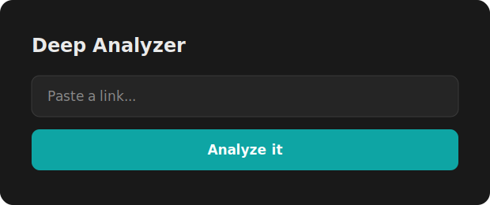

# 🧠 Notion Deep Analyzer

> Share any link and an **LLM reads the actual content** and writes a full breakdown into
> Notion: summary, key facts, insights, personalized next-step checkboxes, a conclusion, a
> **Worth it / Maybe / Skip** verdict and an effort estimate.



## Bring your own AI key
The first provider whose key is set wins — use whichever you like:

| Env var(s) | Provider | Default model |
|---|---|---|
| `AI_BASE_URL` + `AI_API_KEY` | any OpenAI-compatible API (Groq, OpenRouter, Mistral, DeepSeek …) | `gpt-4o-mini` |
| `ANTHROPIC_API_KEY` | Claude | `claude-haiku-4-5` |
| `OPENAI_API_KEY` | OpenAI | `gpt-4o-mini` |
| `GEMINI_API_KEY` | Google Gemini (free tier) | `gemini-2.0-flash` |

Optional `AI_MODEL` overrides the model.

## How it works
1. **Gather real content** — YouTube description/stats (needs `YT_API_KEY`), TikTok caption,
   page text + meta description.
2. **Ask the AI** with a strict-JSON schema; the prompt is *persona-aware* (edit it in
   `analyze.mts` to describe yourself) so the next steps are tailored to you.
3. **Write a rich Notion page** — headings, bullet facts & insights, checkbox next-steps,
   conclusion — set Verdict + Effort properties, and drop a summary comment.
4. **De-dupe first**, so it never wastes an AI call on something already analyzed.

## Endpoint
```
POST /analyze   body: { "key": "<CATCHER_KEY>", "url": "<link>" }
GET  /analyze?key=<CATCHER_KEY>&url=<link>
```

## Deploy
Netlify site + `NOTION_TOKEN`, `CATCHER_KEY`, one AI key from the table, optional `YT_API_KEY`.
Set the Analyzed data-source id in `analyze.mts` (`DS_ID`).

## Security
No API keys are in the code — all providers are read from environment variables at runtime.

## One-click bookmarklet (with a comment)
Prefer a button over the paste box? Make a bookmark that fires the current tab's URL at this
endpoint. Add `&pop=1` for a tidy self-closing confirmation popup, and `&note=<text>` to
attach your own comment — it's saved to the row's **Notes** field (a property added for this):

```
GET /analyze?key=<CATCHER_KEY>&url=<link>&note=<your comment>&pop=1
```

The bundled bookmarklet opens a small window showing what it caught plus a comment box:
**Enter** saves with your comment, **Esc** saves without. Your iPhone POST shortcut is
unaffected (it uses the JSON response).

MIT © Afnan
